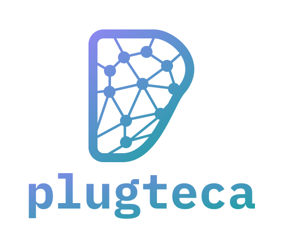

<div style="text-align: center">
  
</div>
<p style="text-align: center">
  A curated marketplace of Claude Code plugins.
</p>

## What is Claude Code Plugin?

Claude Code plugins extend Claude's capabilities with custom commands, agents, skills, hooks, and MCP servers. They allow you to add specialized functionality to your Claude Code environment, from semantic code navigation to external tool integrations, making your development workflow more powerful and tailored to your needs. Learn more in the [official documentation](https://docs.claude.com/en/docs/claude-code/plugins).

## Installation

Add Plugteca to Claude Code:

```bash
/plugin marketplace add bandofai/plugteca
```

Install a plugin:

```bash
/plugin install essentials@plugteca
```

## Available Plugins

### Essentials

Essential MCP servers bundle for enhanced Claude Code capabilities.

#### MCP Servers

- **Serena** - Semantic code navigation with LSP-powered symbol search and editing
- **Context7** - Up-to-date documentation and code examples from current sources
- **Sequential Thinking** - Structured step-by-step problem-solving and reasoning

**Installation:**
```bash
/plugin install essentials@plugteca
```

**Prerequisites:**
- `uv` package manager ([install guide](https://docs.astral.sh/uv/getting-started/installation/))
- Node.js >= v18.0.0

After installing, restart Claude Code to activate the MCP servers.

## License

MIT License
